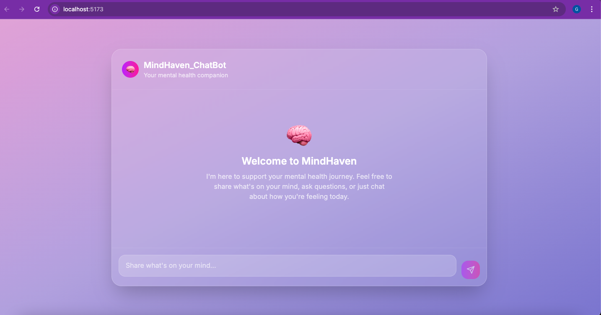
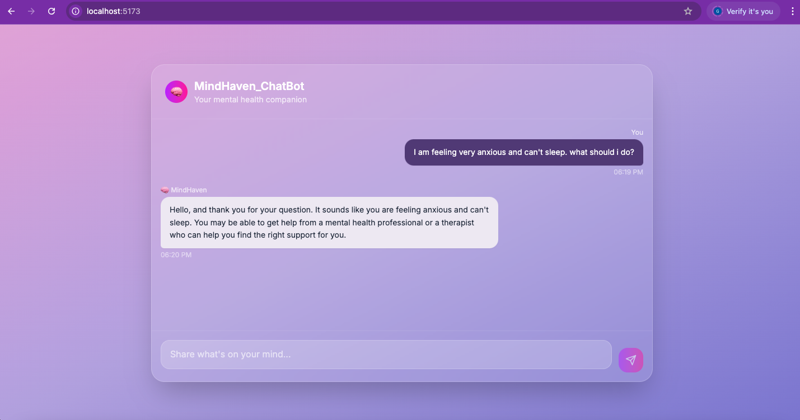

# MindHaven Chatbot

**Domain-Specific Mental Health Assistant Built with T5 & FastAPI + React**

**MindHaven** is a domain-specific mental health chatbot designed to support individuals seeking mental health guidance. It leverages a fine-tuned Transformer model (T5) and delivers responses through a seamless, user-friendly web interface. This project demonstrates the power of NLP in providing supportive, empathetic responses to mental health queries and is fine-tuned on the [Mental Health Counseling Conversations dataset](https://huggingface.co/datasets/Amod/mental_health_counseling_conversations).

**MindHaven_ChatBot_Screenshots**



---

## Project Overview

- **Domain**: Mental Health & Emotional Well-being
- **Model**: `T5-small` fine-tuned on curated Q&A mental health dataset
- **Frameworks**: TensorFlow, Hugging Face Transformers, FastAPI (backend), React + Tailwind CSS (frontend)
- **Deployment**: Backend hosted on Render | Frontend on Vercel

---

## Details

- Built a chatbot tailored to the mental health domain
- Fine-tuned a transformer model for generative Q&A
- Built an intuitive web UI for real-time interaction
- Evaluated performance using BLEU, F1-score and qualitative feedback

---

## Tech Stack

- **Backend**: FastAPI + TensorFlow (T5 fine-tuned model)
- **Frontend**: React + Tailwind CSS + TypeScript
- **Model**: `t5-small` (fine-tuned)
- **Dataset**: [Mental Health Counseling Conversations](https://huggingface.co/datasets/Amod/mental_health_counseling_conversations.

  ---
  
## Dataset

- **Name**: `mindhaven_dataset.json`
- **Format**: JSON lines file with `Context` and `Response` fields
- **Source**: Hugging face [Mental Health Counseling Conversations](https://huggingface.co/datasets/Amod/mental_health_counseling_conversations.
- **Preprocessing**:
  - Lowercasing and whitespace normalization
  - Removal of nulls and noise
  - Renamed `Context` ➝ `input_text`, `Response` ➝ `target_text`

---

## Model Architecture & Training

| Component         | Configuration                          |
|------------------|----------------------------------------|
| Model            | T5-small                               |
| Optimizer        | AdamW (`create_optimizer`)             |
| Learning Rate    | 0.001                                  |
| Warmup Steps     | 200                                    |
| Batch Size       | 8                                      |
| Epochs           | 50                                     |
| Tokenizer        | T5Tokenizer                            |
| Max Length       | 80 tokens                              |

Model was trained using `TFT5ForConditionalGeneration` with early stopping and regularization techniques like:
- `repetition_penalty = 1.5`
- `no_repeat_ngram_size = 2`
- `num_beams = 4`

---

## Performance Metrics

| Metric           | Score     |
|------------------|-----------|
| BLEU Score       | 0.0000    |
| Token-level F1   | 0.1284    |

**Note**: BLEU scores are often low for generative models in open-ended tasks. The F1-score reflects partial word overlap with reference answers.

---

## Qualitative testing Samples

| Question                                           | Response (Generated) |
|---------------------------------------------------|-----------------------|
| I feel anxious and can't sleep at night. What do I do? | It sounds like you are feeling anxious and unable to sleep at night. I would encourage you to seek out a mental health professional who can help you figure out what is going on in your life.|
| I’m always overthinking and feel drained.                  | It sounds like you are experiencing a lot of anxiety and feeling drained. I would encourage you to seek out therapists in your area that can help you find the right fit for you. |
| Lately, I’ve been feeling like I’m not good enough.                       | I am so sorry you are feeling this way. Mental health support can be a very difficult thing to do. It sounds like you have been experiencing some form of mental health issues that may be contributing to depression and anxiety. I would encourage you to seek out therapists in your area that can help you find the right fit for you.. |

---

## Frontend (React + Tailwind)

- Built a responsive, elegant layout with:
  - Gradient background from dusty pink → deep violet
  - Soft bubble UI with labels: MindHaven (bot) & user
  - Send button with animation
- Dynamic fetch to FastAPI `/predict` endpoint

### Backend API (FastAPI)
```bash
POST /predict
{
  "question": "I'm feeling very low lately"
}


Returns:

```json
{
  "response": "You may benefit from talking to a therapist or support group..."
}
```

---

## Deployment

The frontend is locally connected to the backend (FastAPI) as well as deployed on Render [(https://mindhaven-frontend.onrender.com/)]

---

## How to Run Locally

### 1. Clone Repo

```bash
git clone https://github.com/g-tumwesigye/Mindhaven_Chatbot.git
cd Mindhaven_Chatbot
```

### 2. Create Virtual Environment

```bash
python -m venv mindhaven_env
source mindhaven_env/bin/activate
```

### 3. Install Dependencies

```bash
pip install -r requirements.txt
```

### 4. Run FastAPI

```bash
uvicorn app.main:app --reload
```

---

## File Structure

```
Mindhaven_Chatbot/
│
├── README.md                        
├── mindhaven-chatbot.ipynb         
├── bfg.jar                          
├── images/
│   └── mindhaven_chatbot_image.png 
│
├── backend/                         
│   ├── requirements.txt             
│   ├── render.yaml                  
│   └── app/
│       ├── main.py                  
│       └── README.md               
│
├── frontend/                        
│   ├── index.html                   
│   ├── package.json                 
│   ├── tailwind.config.js          
│   ├── tsconfig*.json              
│   ├── vite.config.ts              
│   ├── postcss.config.js           
│   └── src/
│       ├── App.tsx                 
│       ├── main.tsx                
│       ├── index.css               
│       ├── hooks/
│       │   └── useChat.ts          
│       ├── components/             
│       │   ├── ChatInput.tsx       
│       │   ├── ChatWindow.tsx      
│       │   └── MessageBubble.tsx   
│       └── types/                  

```

---

## Demo Video

>  [Click to Watch Demo Video (YouTube)](https://youtu.be/your-demo-link)

---

## Author

Geofrey Tumwesigye

**Email**: g.tumwesigy@alustudent.com

**African Leadership University**

**BSE Student**

---


